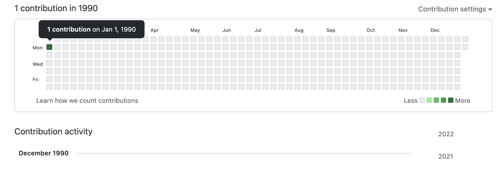
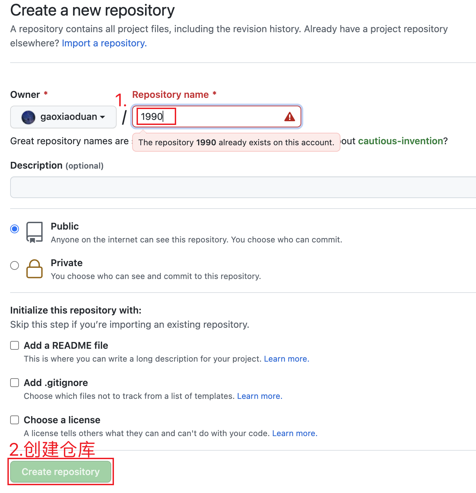

# 1990

> 项目参考[antfu](https://github.com/antfu)的仓库实现
>
> 实现原理：运行shell脚本，将git commit date & git author date时间修改为1990年

通过运行脚本让你的github追溯到**1990**年 如图 : )

## 教程

1. 首先新创建[个人仓库](https://github.com/new)，仓库名字是**1990**

2. 将本项目的index.sh 拷贝到你新创建的仓库下面

3. 运行脚本

   - `sh -c ./index.sh` 
   - 输入你的github账号
   - 最后查看你的github个人主页是否成功

   注意⚠️：

   运行`sh -c ./index.sh`时可能会出现没有运行权限的问题

   如：`-bash: ./xx.sh: Permission denied`

   解决方法：使用`chomd 777 ./index.sh`，给文件添加权限，再执行`sh -c ./index.sh`即可

